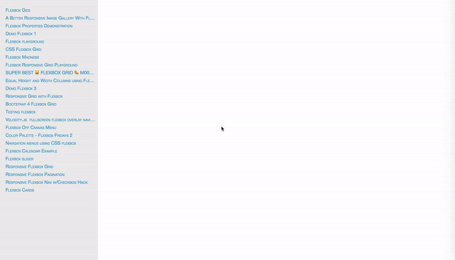

```
╭─╮   ╭─╮   ╭┬╮   ╭─╮   ╭─╮   ╭─╮   ╭╮╭       ┬   ╭─╮
│     │ │    ││   ├┤    ├─╯   ├┤    │││       │   │ │
╰─╯   ╰─╯   ─┴╯   ╰─╯   ┴     ╰─╯   ╯╰╯   o   ┴   ╰─╯
╭────╮╭──╮╭╮╭────╮╭────╮╭────╮ ╭──╮ ╭────╮╭────╮╭─┬─╮                 
│  ╭╮││  ││││  ╭╮││  ╭╮││ ─  │╭╯  ╰╮│ ─  ││ ─  ││   │                 
│  ╰╯││  ╰╯││  ╰╯││  ╰╯││    │╰╮  ╭╯│    ││    ││  ╭╯                 
│   ╭╯│    ││   ╭╯│   ╭╯│ ───┤ │ ─┤ │ ───┤│ ───┤│  │                  
╰───╯ ╰───┴╯╰───╯ ╰───╯ ╰────╯ ╰──╯ ╰────╯╰────╯╰──╯                  
```
> Use Puppeteer to download pens from Codepen.io as single html pages.

## Features

- Download example pens as single html pages
- Easy preview with an index page
- Built-in error recovery to resume download
- Skip already downloaded pens
- Easy to debug using screenshots
- Custom template pages
- Easy to follow source code with comments

## Usage

- Clone this project locally,

```bash
git clone https://github.com/websemantics/codepen-puppeteer
cd codepen-puppeteer
```

- Install dependencies (`puppeteer`),

```bash
npm i
```

- Change search query @ `./index.js` line `#14`

- Start download

```bash
npm run download
```

- Browse to `./pens/index.html` to preview full list of downloads

## Debug

This project is a proof of concept so you might find problematic pens that wouldn't download fully. Turn the debug flag on (`debug = true`) @ `./index.js` line `#13` to enable screenshots which might help you debug the issue.

## Hint

I find the following command useful to force quit running `chromium` processes on OSX

```
pkill -f -- "chromium"
```

## Preview Downloads



## Resources

- [Puppeteer - Headless Chrome Node API](https://github.com/GoogleChrome/puppeteer)
- [Getting started with Puppeteer and Chrome Headless for Web Scraping](https://medium.com/@e_mad_ehsan/getting-started-with-puppeteer-and-chrome-headless-for-web-scrapping-6bf5979dee3e)

## Support

Need help or have a question? post at [StackOverflow](https://stackoverflow.com/questions/tagged/codepen-puppeteer+websemantics).

*Please don't use the issue trackers for support/questions.*

*Star if you find this project useful, to show support or simply for being awesome :)*

## Contribution

Contributions to this project are accepted in the form of feedback, bugs reports and even better - pull requests.

## License

[MIT license](http://opensource.org/licenses/mit-license.php) Copyright (c) Web Semantics, Inc.